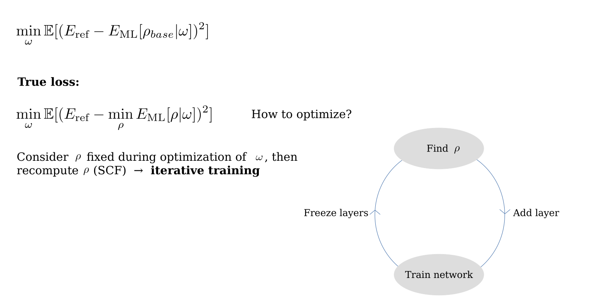

Quickstart
=============

The new version of NeuralXC only implements the neural network architecture along with routines to train and test functionals. As neural networks are trained self-consistently, an electronic structure code to drive these calculations is needed. For this purpose, we have developed Libnxc, which allows for easy interfacing with electronic structure codes such as SIESTA and CP2K. Its python version, pylibnxc is installed automatically together with this package and works with PySCF out-of-the-box.

To get accustomed with NeuralXC, we recommend that PySCF is used as the driver code. Examples on how to train and deploy a machine learned functional can be found in examples/example_scripts/.

To train/fit a functional a set of structures and their associated reference energies is required. These structures need to be provided in an ASE formatted .xyz or .traj file (in this example training_structures.xyz). Self-consistent training can then be performed by running::

  neuralxc sc training_structures.xyz basis.json hyperparameters.json

- basis.json contains information regarding the basis set as well as the 'driver' program (PySCF), examples can be found in examples/inputs/ml_basis/.

- hyperparameters.json contains the machine learning hyperparameters, examples can be found in examples/inputs/hyper.

A minimal input file structure would look something like this:

basis.json ::

    {
      "preprocessor":
      {
           "basis": "cc-pVTZ-jkfit",
           "extension": "chkpt",
           "application": "pyscf"
      },
      "n_workers" : 1,
      "engine_kwargs": {"xc": "PBE",
                        "basis" : "cc-pVTZ"}

    }

hyperparameters.json ::

    {
        "hyperparameters": {
            "var_selector__threshold": 1e-10,
            "estimator__n_nodes": 16,
            "estimator__n_layers": 3,
            "estimator__b": 1e-5,
            "estimator__alpha": 0.001,
            "estimator__max_steps": 2001,
            "estimator__valid_size": 0.2,
            "estimator__batch_size": 32,
            "estimator__activation": "GELU",
        },
        "cv": 6
    }

A detailed explanation of these files is given in :ref:`Input`.

NeuralXC will train a model self-consistently on the provided structures. This means an initial model is fitted to the reference energies.
This model is then used to run self-consistent calculations on the dataset producing updated baseline energies. Another model is fitted on
the difference between the reference and updated baseline energies and self-consistent calculations are run with the new model. This is
done iteratively until the model error converges within a given tolerance. This tolerance can be set with the `--tol` flag, the default is 0.5 meV.

