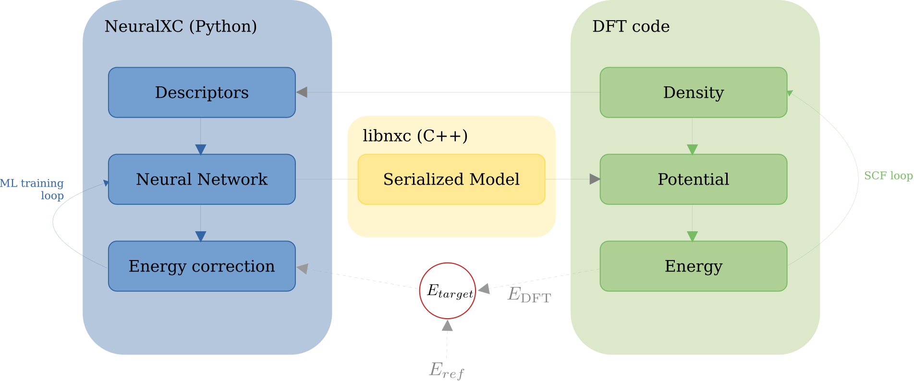

Self-consistent training
=========================

In order to use NeuralXC functionals within DFT calculations, models need to be trained self-consistently on the provided structures.
This means, an initial model is fit to the reference energies.
This model is then used to run self-consistent calculations on the dataset producing updated baseline energies.
The model is re-fitted on the difference between the reference and updated baseline energies and self-consistent calculations
are run with the updated model. This is done iteratively until the model error converges within a given tolerance.

The self-consistent training procedure requires that a set commands is executed in a well-defined order.
In addition to running the self-consistent calculations which requires communication with an electronic
structure code, data needs to be tracked, models optimized and error statistics need to be collected.

In order to facilitate self-consistent training, NeuralXC provides a simple command that combines
the required steps and automatically produces a final model that is ready for use within DFT calculations::

    neuralxc sc <xyz> <config> <hyper>

conducts self-consistent training for the structures specified in a system geometry file `<xyz>`
using the engine and basis set specified in `<config>` and ML hyperparameters provided in `<hyper>`.
Optional flags include::

  --maxit <int>   Maximum number of iterations,
                    if zero create an energy-correcting model only (default: 5)
  --tol <float>   Energy tolerance in eV that
                    determines whether self-consistent training has converged (default 0.0005)
  --hyperopt      If set, optimize hyperparameters
                    by cross-validation at every ML training iteration
